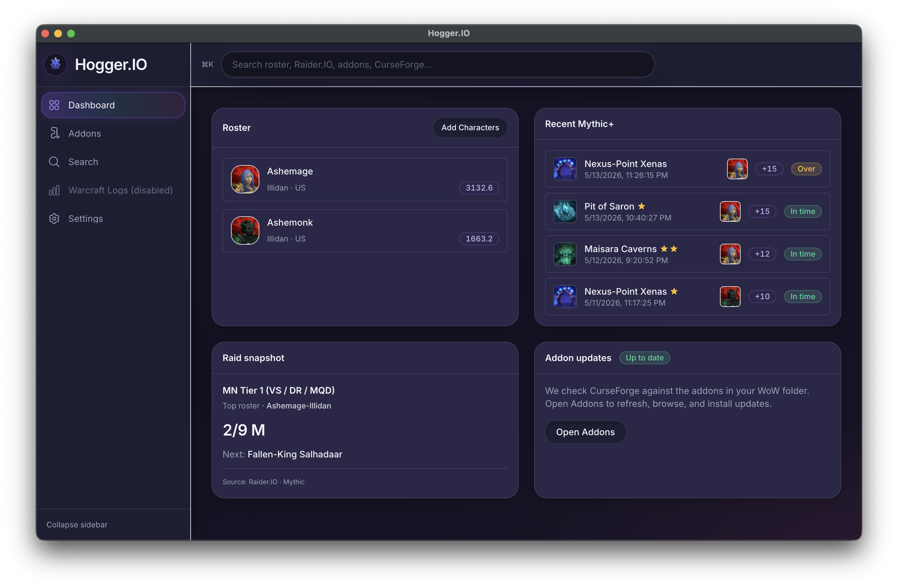

  

<h1 align="center">Hogger.IO</h1>

  <strong>Your World of Warcraft companion on the desktop</strong> 
  Addons, alts, keys, and raid snapshot in one place. Less tab hunting, more playing.

  

  
  

---

## What you get

- **Addons:** Browse and manage addons from one window instead of a pile of browser tabs.
- **Roster:** Keep your characters handy; jump between alts without losing context.
- **Mythic+:** Recent runs, key levels, and results in a layout that’s easy to skim between queues.
- **Raid snapshot:** A quick read on where your group’s at when you’re planning the week.
- **Data you already use:** Ties into outside tools when you want to go deeper than the dashboard.
- **Looks the part:** Dark UI built for long nights; it stays readable when you’re tired after raid.

## Get the app

Grab the latest build here:

**[Releases (download) →](https://github.com/Shaneciora/Hogger.IO/releases/latest)**

| Platform     | What to download |
| ------------ | ---------------- |
| **macOS**    | `.dmg` or `.zip`: pick the build that matches your Mac (Apple Silicon vs Intel) |
| **Windows**  | `.exe`: installer or portable, whichever the release notes label |
| **Linux**    | `.AppImage` |

Stick to **this repo’s Releases page** so you’re always getting the real installers.

### Updates

New versions land on **Releases** when they’re ready. Watching the repo or checking back now and then is the easiest way to stay current.

## What you need

- **macOS**, **Windows 10/11**, or a recent **64‑bit Linux** distro
- **Internet** when the app pulls live data (addons, character info, etc.)

## Safety & downloads

- Builds are **produced in CI** and **attached to GitHub Releases** for this repository.
- On **macOS or Windows**, the first launch might warn you the app isn’t signed or notarized yet. That can happen with early releases. Only grab installers from **[Releases](https://github.com/Shaneciora/Hogger.IO/releases)** here.
- The app **isn’t open source**. This public repo is here so you can **download official builds** and know what you’re running, not to distribute source.

## Say hi

Spotted a bug, want a feature, or just have feedback? **[Open an issue](https://github.com/Shaneciora/Hogger.IO/issues).**

---

  <strong>Hogger.IO:</strong> one window for the stuff you actually care about in Azeroth.

